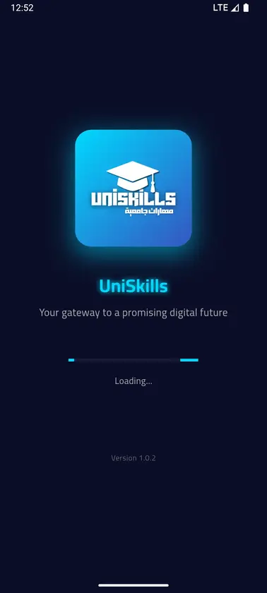

# 🖼️ نظام تحميل الصور المتقدم

## ✨ المميزات الجديدة

تم إضافة نظام تحميل احترافي للصور مع:
- ✅ Loading spinner أثناء التحميل
- ✅ Retry mechanism (3 محاولات)
- ✅ Error handling مع زر إعادة المحاولة
- ✅ Progressive loading
- ✅ Cache busting للـ retries
- ✅ Exponential backoff

---

## 🎯 كيف يعمل النظام؟

### 1. Loading State
عند بدء تحميل الصورة:
```javascript
item.classList.add('loading');
```

**المظهر:**
- Spinner دوار أزرق
- الصورة تكون باهتة (opacity: 0.3)
- Blur effect خفيف

### 2. Success State
عند نجاح التحميل:
```javascript
item.classList.remove('loading');
item.classList.add('loaded');
```

**المظهر:**
- Fade in animation سلسة
- الصورة تظهر بوضوح كامل

### 3. Error State
عند فشل التحميل:
```javascript
item.classList.add('error');
```

**المظهر:**
- إيموجي تحذير ⚠️
- خلفية حمراء خفيفة
- زر "🔄 إعادة المحاولة"
- الصورة grayscale

---

## 🔄 Retry Mechanism

### كيف يعمل؟

1. **المحاولة الأولى**: فوراً
2. **المحاولة الثانية**: بعد ثانية واحدة
3. **المحاولة الثالثة**: بعد ثانيتين
4. **بعد 3 محاولات**: يظهر زر إعادة المحاولة

### Exponential Backoff
```javascript
setTimeout(() => {
    loadImage();
}, 1000 * retryCount); // 1s, 2s, 3s...
```

### Cache Busting
```javascript
const cacheBuster = retryCount > 0 ? `?retry=${retryCount}&t=${Date.now()}` : '';
newImg.src = originalSrc + cacheBuster;
```

---

## 🎨 CSS States

### Loading State
```css
.screenshot-item.loading::before {
    content: '';
    width: 40px;
    height: 40px;
    border: 3px solid rgba(255, 255, 255, 0.1);
    border-top-color: var(--accent-primary);
    border-radius: 50%;
    animation: spin 0.8s linear infinite;
}

.screenshot-item.loading img {
    opacity: 0.3;
    filter: blur(4px);
}
```

### Error State
```css
.screenshot-item.error {
    background: rgba(255, 59, 48, 0.1);
    border: 2px solid rgba(255, 59, 48, 0.3);
}

.screenshot-item.error::before {
    content: '⚠️';
    font-size: 48px;
    animation: pulse 2s ease-in-out infinite;
}

.screenshot-item.error img {
    opacity: 0.2;
    filter: grayscale(1);
}
```

### Loaded State
```css
.screenshot-item.loaded img {
    animation: fadeIn 0.5s ease forwards;
}

@keyframes fadeIn {
    from {
        opacity: 0;
        transform: scale(0.95);
    }
    to {
        opacity: 1;
        transform: scale(1);
    }
}
```

---

## 🔧 JavaScript Implementation

### Main Loading Function
```javascript
function loadImage() {
    const newImg = new Image();
    
    newImg.onload = function() {
        // Success
        item.classList.remove('loading');
        item.classList.add('loaded');
        img.src = originalSrc;
    };
    
    newImg.onerror = function() {
        retryCount++;
        
        if (retryCount < maxRetries) {
            // Retry
            setTimeout(() => {
                loadImage();
            }, 1000 * retryCount);
        } else {
            // Show error
            item.classList.add('error');
            // Add retry button
        }
    };
    
    newImg.src = originalSrc + cacheBuster;
}
```

### Retry Button
```javascript
const retryBtn = document.createElement('button');
retryBtn.textContent = '🔄 إعادة المحاولة';
retryBtn.onclick = function() {
    retryBtn.remove();
    item.classList.remove('error');
    item.classList.add('loading');
    retryCount = 0;
    loadImage();
};
item.appendChild(retryBtn);
```

---

## 📊 Console Logging

النظام يطبع معلومات مفيدة في Console:

```javascript
console.log(`Retrying image ${index + 1}, attempt ${retryCount + 1}/${maxRetries}`);
console.error(`Failed to load image ${index + 1} after ${maxRetries} attempts`);
```

**مثال:**
```
Retrying image 3, attempt 2/3
Retrying image 3, attempt 3/3
Failed to load image 3 after 3 attempts
```

---

## 🎯 Progressive Loading

الصور تحمل بشكل تدريجي:
```javascript
setTimeout(() => {
    item.classList.remove('loading');
    item.classList.add('loaded');
}, index * 100); // 0ms, 100ms, 200ms...
```

**النتيجة:**
- الصورة الأولى تظهر فوراً
- الثانية بعد 100ms
- الثالثة بعد 200ms
- وهكذا...

---

## 🌙 Dark Mode Support

### Loading Spinner
```css
[data-theme="dark"] .screenshot-item.loading::before {
    border-color: rgba(0, 217, 255, 0.1);
    border-top-color: var(--neon-blue);
}
```

### Error State
نفس التصميم في Light و Dark mode

---

## 🚀 الأداء

### قبل التحديث:
- ❌ الصور تفشل بدون retry
- ❌ لا يوجد feedback للمستخدم
- ❌ لا يوجد error handling

### بعد التحديث:
- ✅ 3 محاولات تلقائية
- ✅ Loading indicator واضح
- ✅ Error state مع زر retry
- ✅ Progressive loading سلس
- ✅ Cache busting للـ retries

---

## 🐛 حل المشاكل

### المشكلة: الصور لا تزال لا تحمل
**الأسباب المحتملة:**
1. الصور غير موجودة في مجلد `screens/`
2. أسماء الملفات غير صحيحة
3. مشكلة في الـ server

**الحل:**
1. تحقق من وجود الصور:
```bash
dir screens
```

2. تحقق من Console للأخطاء:
```
F12 → Console
```

3. اضغط على زر "🔄 إعادة المحاولة"

### المشكلة: Loading spinner لا يظهر
**الحل:**
1. امسح الكاش (Ctrl+Shift+R)
2. تأكد من تحميل style.css?v=10

### المشكلة: الصور تحمل ببطء
**الحل:**
1. صغّر حجم الصور (استخدم TinyPNG)
2. حوّل إلى WebP format
3. استخدم CDN

---

## 💡 تحسينات مستقبلية

### 1. Skeleton Loading
```css
.screenshot-item.loading::before {
    background: linear-gradient(
        90deg,
        rgba(255,255,255,0.1) 25%,
        rgba(255,255,255,0.2) 50%,
        rgba(255,255,255,0.1) 75%
    );
    animation: shimmer 2s infinite;
}
```

### 2. Blur Hash
استخدام blur hash كـ placeholder

### 3. Intersection Observer
تحميل الصور فقط عند الوصول إليها

### 4. WebP with Fallback
```html
<picture>
    <source srcset="screens/1.webp" type="image/webp">
    
</picture>
```

---

## 📋 الملفات المعدلة

- ✅ `style.css` - Loading, Error, Loaded states
- ✅ `script.js` - Advanced loading system
- ✅ `index.html` - Version updates (v=10)

---

## 🧪 للاختبار

### Test 1: Normal Loading
1. افتح الموقع
2. scroll للـ Screenshots
3. شوف Loading spinners
4. شوف Fade in animation

### Test 2: Error Handling
1. غيّر اسم صورة في HTML
2. reload الصفحة
3. شوف Error state
4. اضغط "إعادة المحاولة"

### Test 3: Slow Connection
1. افتح DevTools (F12)
2. Network → Slow 3G
3. reload الصفحة
4. شوف Progressive loading

### Test 4: Dark Mode
1. غيّر للـ Dark mode
2. شوف Loading spinner بالـ neon blue
3. شوف Error state

---

## ✅ النتيجة

الآن نظام تحميل الصور:
- ✅ احترافي جداً
- ✅ يتعامل مع الأخطاء
- ✅ يعيد المحاولة تلقائياً
- ✅ يعطي feedback واضح للمستخدم
- ✅ Progressive loading سلس
- ✅ Dark mode support

---

**تم التحديث**: 22 فبراير 2026
**الحالة**: ✅ جاهز للاستخدام
**الإصدار**: v=10
